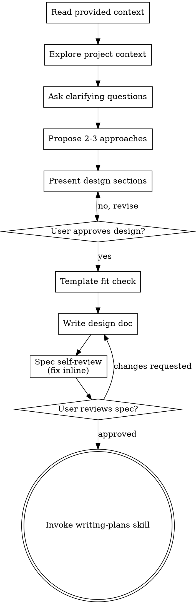

# Brainstorming Ideas Into Designs

Help turn ideas into fully formed specs through natural collaborative dialogue.

Start by reading the context the user gave you, then study the codebase, then ask questions one at a time to refine the idea. Once you understand what you're building, present the design and get user approval.

<HARD-GATE>
Do NOT invoke any implementation skill, write any code, scaffold any project, or take any implementation action until you have presented a design and the user has approved it.
</HARD-GATE>

## Core Principles

These principles override the rest of this skill when in conflict.

1. **Context before code.** Before exploring the codebase, carefully read the context the user provided - the task description, linked tickets, attached files, references, and any constraints stated in the message. Only then explore the code. The design must reflect what the user actually asked for, not what you assume.
2. **Specs carry design, not code.** The spec describes WHAT to build and WHY, with references to classes, methods, fields, configurations, tables, DTOs, and contracts (JSON Schema, schemas, config). It MUST NOT contain implementation logic - method bodies, algorithms, or actual code. Writing code is the job of the agent that implements the plan. Your job here is to design.

## Checklist

You MUST create a task for each of these items and complete them in order:

1. **Read the provided context** - the task description, linked tickets, attachments, and any constraints the user stated. Parse intent and boundaries before touching the codebase
2. **Explore project context** — check files, docs, recent commits
3. **Ask clarifying questions** — one at a time, understand purpose/constraints/success criteria
4. **Propose 2-3 approaches** — with trade-offs and your recommendation
5. **Present design** — in sections scaled to their complexity, get user approval after each section
6. **Template fit check** — if a project-level `docs/superpowers/spec-template.md` exists, map the approved design onto it; surface every mismatch in one message and ask before deviating. Skip if absent. See Custom Spec Template.
7. **Write design doc** — save to `docs/superpowers/specs/YYYY-MM-DD-<topic>-design.md` and commit
8. **Spec self-review** — quick inline check for placeholders, contradictions, ambiguity, scope (see below)
9. **User reviews written spec** — ask user to review the spec file before proceeding
10. **Transition to implementation** — invoke writing-plans skill to create implementation plan

## Process Flow

**The terminal state is invoking writing-plans.** Do NOT invoke any implementation skill. The ONLY skill you invoke after brainstorming is writing-plans.

## The Process

**Understanding the idea:**

- Read the user-provided context first (task text, links, attachments, stated constraints). Note explicit requirements and boundaries before exploring anything.
- Check out the current project state first (files, docs, recent commits).
- Before asking detailed questions, assess scope: if the request describes multiple independent subsystems, flag this immediately. Don't refine details of a project that needs decomposition first.
- If the project is too large for a single spec, help the user decompose into sub-projects: what are the independent pieces, how do they relate, what order should they be built? Then brainstorm the first sub-project through the normal design flow. Each sub-project gets its own spec → plan → implementation cycle.
- For appropriately-scoped projects, ask questions one at a time to refine the idea.
- Prefer multiple choice questions when possible, but open-ended is fine too.
- Only one question per message - if a topic needs more exploration, break it into multiple questions.
- Focus on understanding: purpose, constraints, success criteria.

**Exploring approaches:**

- Propose 2-3 different approaches with trade-offs.
- Present options conversationally with your recommendation and reasoning.
- Lead with your recommended option and explain why.

**Presenting the design:**

- Once you believe you understand what you're building, present the design.
- Scale each section to its complexity: a few sentences if straightforward, up to 200-300 words if nuanced.
- Ask after each section whether it looks right so far.
- Cover: architecture, components, data flow, error handling, testing.
- The design describes behavior and structure.
- NOT code. Reference classes, methods, fields, configs, DTOs, contracts; do not write their bodies.
- Be ready to go back and clarify if something doesn't make sense.

**Design for isolation and clarity:**

- Break the system into smaller units that each have one clear purpose, communicate through well-defined interfaces, and can be understood and tested independently.
- For each unit, you should be able to answer: what does it do, how do you use it, and what does it depend on?
- Can someone understand what a unit does without reading its internals? Can you change the internals without breaking consumers? If not, the boundaries need work.
- Smaller, well-bounded units are easier to reason about and edit reliably. When a file grows large, that's often a signal that it's doing too much.

**Working in existing codebases:**

- Explore the current structure before proposing changes. Follow existing patterns.
- Where existing code has problems that affect the work (e.g., a file that's grown too large, unclear boundaries, tangled responsibilities), include targeted improvements as part of the design - the way a good developer improves code they're working in.
- Don't propose unrelated refactoring. Stay focused on what serves the current goal.

## After the Design

**Documentation:**

- Write the validated design (spec) to `docs/superpowers/specs/YYYY-MM-DD-<topic>-design.md`.
  - (User preferences for spec location override this default).
- If a project-level `docs/superpowers/spec-template.md` is present, conform by default and surface any mismatches before writing rather than silently extending the template — see Custom Spec Template for the fit-check protocol.
- Use elements-of-style:writing-clearly-and-concisely skill if available.
- The spec carries design, NOT implementation code. Reference classes, methods, fields, configs, DTOs, and contracts freely; do not include method bodies or algorithms. JSON Schema, DTO structures, and config snippets that define **contracts** are allowed - implementation logic is not.
- Commit the design document to git.

**Spec Self-Review:**
After writing the spec, look at it with fresh eyes:

1. **Template conformance (if `docs/superpowers/spec-template.md` is present):** Does it follow the template? Are required sections present, optional ones either dropped or filled?
2. **Code leakage:** Did implementation logic (method bodies, algorithms) sneak in? Remove it - keep only design, contracts and references. 
3. **Placeholder scan:** Any "TBD", "TODO", incomplete sections, or vague requirements? Fix them.
4. **Internal consistency:** Do any sections contradict each other? Does the architecture match the feature descriptions?
5. **Scope check:** Is this focused enough for a single implementation plan, or does it need decomposition?
6. **Ambiguity check:** Could any requirement be interpreted two different ways? If so, pick one and make it explicit.

Fix any issues inline. No need to re-review — just fix and move on.

**User Review Gate:**
After the spec review loop passes, ask the user to review the written spec before proceeding:

> "Spec written and committed to `<path>`. Please review it and let me know if you want to make any changes before we start writing the implementation plan."

Wait for the user's response. If they request changes, make them and re-run the spec review loop. Only proceed once the user approves.

**Implementation:**

- Invoke the writing-plans skill to create the implementation plan.
- Do NOT invoke any other skill. writing-plans is the next step.

## Custom Spec Template

Specs are freeform unless the project provides `docs/superpowers/spec-template.md` — a project-level file read at spec-writing time and never written to. It shapes only the written spec, never the brainstorming conversation.

**Format.** A markdown outline of sections, each a suggestion unless its heading is suffixed `[required]` (strip that tag from the output).

**Fit check.** Map the approved design onto the template. Drop non-required sections silently. For any `[required]` section that doesn't fit, any section the task needs but the template lacks, or any conflict — present all mismatches in one batched message and ask before deviating.

## Key Principles

- **Context before code** - Read what user gave you before exploring the codebase.
- **One question at a time** - Don't overwhelm with multiple questions.
- **Multiple choice preferred** - Easier to answer than open-ended when possible.
- **YAGNI ruthlessly** - Remove unnecessary features from all designs.
- **Explore alternatives** - Always propose 2-3 approaches before settling.
- **Incremental validation** - Present design, get approval before moving on.
- **Be flexible** - Go back and clarify when something doesn't make sense.
- **Specs carry design, not code** - References and contracts yes, implementation logic no.
- **If template is present, follow it** - And surface template gaps rather than working around them.
