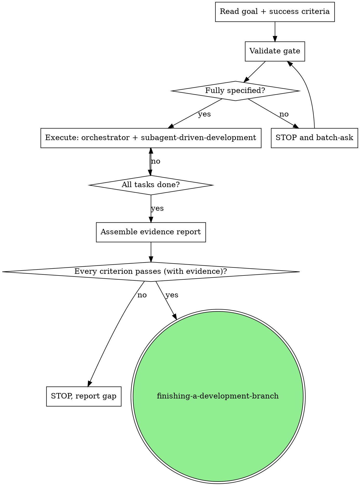

# Define-and-Execute

Run a fully-specified task end-to-end as an **orchestrator** and prove it works with an evidence report. The user states a **goal** and **success criteria** up front; you validate them, execute through subagents, and return concrete proof for each criterion.

This is the fast path that **skips brainstorming and writing-plans** — the task is already specified. It keeps rigorous delegated execution and review, and adds a strict **stop-and-ask** contract and an **evidence report** finish.

<HARD-GATE>
Do NOT begin execution until the Validate gate has passed: the goal is restatable, every success criterion is testable (Observable + Specific + Verifiable — see Phase 1), and every decision the work requires is stated. If anything is missing or unstated, STOP and ask — do not assume, do not improvise, do not fabricate.
</HARD-GATE>

## The Contract

- **Input (precondition):** a goal + a list of success criteria.
- **Output:** an evidence report mapping each criterion to concrete, pasted proof.
- **Non-outputs:** no spec doc, and it does not invoke `writing-plans`. (The orchestrator writes a lightweight task list directly — see Phase 2.) If the task needs design exploration or an exhaustive plan, it wasn't fully specified — use `brainstorming` / `writing-plans` instead.

## Routing

| Task shape | Skill | Ambiguity handling |
|---|---|---|
| Design still open — you don't know *what* to build | `brainstorming` | design dialogue |
| Fully specified — goal + testable criteria; want dialogue on any surprise | **define-and-execute** | **stop and ask** on anything unstated |
| Well-defined, but stepping away — want delivery, not dialogue | `autonomous-executor` | decide-and-note |

The line between this skill and `autonomous-executor` is the ambiguity posture: this one **stops**, that one **decides and notes**.

## Core Principles

1. **Fully-specified is the precondition.** Your first act is to check it. If it doesn't hold, stop — don't soften it into "I'll figure it out."
2. **Orchestrate, don't implement.** You decompose, delegate, review, reconcile, and synthesize. Implementation is always delegated to a subagent.
3. **Evidence, not assertions.** A criterion is met only when concrete output proves it. "Tests pass" is not evidence of the right behavior.
4. **Stop, don't fabricate.** Never invent a requirement, assume an unstated decision, or claim success without proof.

## The Process

**The graph shows the happy path only.** During execution, if a subagent surfaces an unstated decision, an unresolvable blocker, or intent divergence, STOP and batch-ask the user, then resume. These mid-run STOPs (triggers 3-5) are omitted from the graph for readability; they override subagent-driven-development's no-check-in norm — see Phase 2.

### Phase 1 — Validate (the gate)

Before any execution:

1. **Restate the goal** in one sentence. If you can't restate it confidently → STOP (trigger 1).
2. **Score each success criterion** against the testability rubric. A criterion is good only if all three hold:
   - **Observable** — describes an outcome you can see or measure (HTTP response body and status, database row, log line, exit code), not an internal quality ("clean", "well-architected", "performant").
   - **Specific** — the expected value or state is concrete enough to check against ("returns 200 with `{"status":"ok"}`", not "works").
   - **Verifiable** — you can name the command, query, or observation that would prove it.

   Any criterion that fails → STOP (trigger 2) and ask the user to sharpen it.
3. **Enumerate unstated decisions.** Walk the task and list every choice the execution will need that isn't determined by the goal, the criteria, or the existing repo — port, error-response shape, whether a new dependency is acceptable, etc. If the list is non-empty → STOP (trigger 3) and batch-ask all of them in one message.
4. **The gate passes** only when the goal is restatable, every criterion is testable, and the unstated-decisions list is empty. Then — and only then — proceed to Phase 2.

This front-loads every gate-discoverable question into one batch, so "strict stop" doesn't mean "interrupt every thirty seconds." Questions the gate can't foresee may still surface mid-execution — see Phase 2.

### Phase 2 — Execute (orchestrator + subagent-driven-development)

**Role: orchestrator.** You decompose, delegate, review subagent output, reconcile conflicting findings, and synthesize. You hold the high-level context so subagents don't have to. You implement nothing directly.

**Always use subagent-driven-development.** Every implementation task flows through SDD's loop structure unchanged: fresh implementer per task → task-reviewer (spec compliance + quality) → fix loop → next task → final whole-branch review. Inherit its model selection, file-handoff, and progress-ledger practices as-is. The lightweight task list (next paragraph) is the `PLAN_FILE` SDD's `task-brief` parses, so it satisfies SDD's "have implementation plan?" admission. For each task-reviewer dispatch, split the validated contract across SDD's two inputs: the **brief file** carries the task's requirements and interface contracts; the **global-constraints block** carries the goal and success criteria.

**Decomposition replaces writing-plans.** You decompose the validated goal and criteria into delegable tasks and write them to a **lightweight task-list file** — a plan-equivalent with one `## Task N` section per task, each carrying its requirements, the interface contracts it touches, and the success criteria that bind it. This is not a `writing-plans` document (no exhaustive bite-sized steps, no code); it is a lean decomposition produced directly — just enough for SDD to dispatch against. SDD's `task-brief` reads this file as its `PLAN_FILE` and extracts each `## Task N` section into the implementer's brief. (SDD's prompt templates refer to this file as "the plan".)

**Strict-stop overrides SDD's continuous execution.** SDD normally runs without check-ins; this skill overrides that. When an implementer surfaces `NEEDS_CONTEXT` or a question:

- if the answer is **determined by the validated contract or the existing repo** → answer it and re-dispatch;
- if the question **reveals a decision the gate missed** (something unstated) → STOP and ask the user (trigger 3; batch it with any others); do not decide-and-note;
- on a `BLOCKED` you can't resolve with stated information → STOP (trigger 4).
- if **what the user wants and what you're about to do have diverged** → STOP (trigger 5).

That is the core integration: SDD's "answer subagent questions yourself" becomes **answer from the contract, or escalate to the user.**

**You do directly (never delegated):** the Validate gate, decomposition, user clarifications, reconciling subagent findings, and assembling the evidence report.

**Compose with isolation and finishing.** Run inside `using-git-worktrees` (SDD requires isolation) and close with `finishing-a-development-branch` once the evidence report is clean.

### Phase 3 — Report (evidence, not assertions)

After the final whole-branch review, assemble an evidence report. **Exercise each success criterion** — send the real request, query the real database, tail the real logs, run the real command — and paste the concrete outputs. Never paraphrase. (Inherits `verification-before-completion`'s "evidence before claims", extended to a multi-criterion report.) Delegate complex evidence-gathering to a verification subagent; do simple checks directly.

Report shape:

- **Goal** (one line) + **verdict** — all criteria met, or N gaps.
- **Per criterion:** the criterion → scenario(s) tested → concrete inputs (the actual JSON or command) → concrete observed outputs (HTTP body and status, database row, log excerpt, test output — pasted) → pass or fail.
- **A criterion you cannot evidence, or that fails when exercised, is a gap, not a success** — report it as a STOP; do not claim done. Leave the branch open for the user; do not invoke `finishing-a-development-branch`.
- **Q&A log** — every question batched at the gate or mid-run, with the user's answers. Under strict stop, this is the main decisions record; almost nothing was decided-and-noted.
- **Evidence sources** — commands run, files and logs inspected.

Save the **evidence report** (not a spec or plan) to a file for the session record.

## The Stop Rule (never fabricate)

STOP and ask the user — do not invent, assume, or continue — when:

1. the **goal** is ambiguous, contradictory, or can't be confidently restated;
2. any **success criterion** fails the testability rubric;
3. any **decision the work requires is unstated** — at the gate or surfaced by a subagent;
4. you're **BLOCKED** with no stated path (missing access, dependency conflict, environment failure);
5. **intent diverges** — what the user wants and what you're about to do have parted ways.

**Never:** invent a requirement, fabricate output, claim a criterion met without concrete evidence, or decide-and-continue on something unstated.

### Rationalizations to resist

| Excuse | Reality |
|---|---|
| "I'll just pick the sensible default and note it" | That's `autonomous-executor`. This skill stops and asks on anything unstated. |
| "The criterion is basically met — tests pass" | Tests passing ≠ the criterion's observable outcome. Exercise it and paste the proof. |
| "I can infer what they meant" | Inference about an unstated decision is fabrication. Stop and ask. |
| "It's a tiny choice; asking wastes their time" | Batch it with other questions at the next stop. Don't decide-and-continue. |
| "The implementer subagent already decided" | A subagent deciding an unstated item is still an unstated item. Override and escalate. |

## Composition

- **subagent-driven-development** — the execution engine; reuse its `implementer-prompt.md`, `task-reviewer-prompt.md`, `review-package` / `task-brief` scripts, and progress ledger.
- **using-git-worktrees** — isolation for the long-running session.
- **finishing-a-development-branch** — close out once the evidence report is clean.
- **verification-before-completion** — the evidence-before-claims discipline the report rests on.

## Red Flags

**Never:**

- Begin execution before the Validate gate passes.
- Decide-and-note an unstated decision instead of stopping — that is `autonomous-executor`'s job, not this skill's.
- Accept "tests pass" or "should work" as evidence for a success criterion.
- Let a subagent's self-report replace exercising the criterion yourself (or via a verification subagent).
- Claim a criterion is met when you could not produce concrete output for it — report the gap and stop.
- Write a spec doc or plan doc unprompted; if you feel you need one, the task wasn't fully specified — say so and stop.
