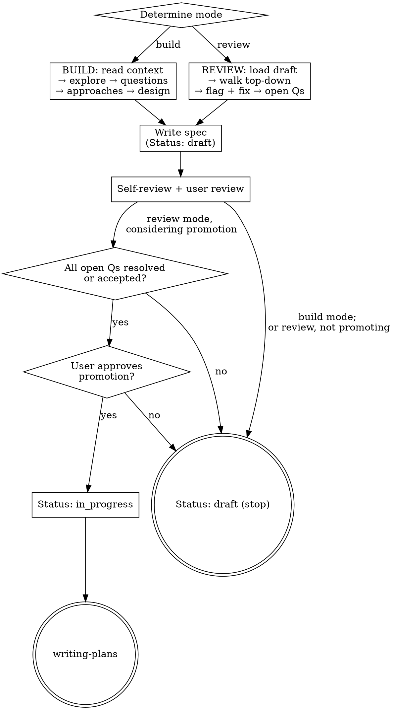

# Spec Brainstorming (Analyst build round + Developer review round)

Turn ideas into plan-ready specs through a two-round lifecycle tailored for a team with a **system analyst** and a **developer**. The same design thinking drives both rounds — they differ only in entry state, terminal action, and the status they write.

<OPT-IN>
This skill is **opt-in**. Invoke it only when the user explicitly requests a spec build or spec review round — e.g., they name this skill, ask to "build a spec", "review the draft spec", or reference the analyst/developer rounds. Do NOT self-invoke for general "let's build X" requests, new features, or open-ended creative work. Route those to the regular `brainstorming` skill instead. If you were loaded on a marginal match and the request is general creative work, say so and use `brainstorming`.
</OPT-IN>

<HARD-GATE>
Do NOT write any code, scaffold any project, or invoke any implementation skill until a design has been presented and the user has approved it. This applies to EVERY project regardless of perceived simplicity.
In **build mode**: additionally do NOT invoke `writing-plans` — the round ends at a draft spec, full stop.
In **review mode**: do NOT invoke `writing-plans` unless the spec is being approved and its `Status` is being set to `in_progress`.
</HARD-GATE>

## Core Principles

These principles override the rest of this skill when in conflict.

1. **Context before code.** Before exploring the codebase, carefully read the context the user provided — the task description, linked tickets, attached files, references, and any constraints stated in the message. Only then explore the code. The design must reflect what the user actually asked for, not what you assume.
2. **Specs carry design, not code.** The spec describes WHAT to build and WHY, with references to classes, methods, fields, configurations, tables, DTOs, and contracts (JSON Schema, schemas, config). It MUST NOT contain implementation logic — method bodies, algorithms, or actual code. Writing code is the job of the agent that implements the plan. Your job here is to design.
3. **Same depth for both roles — never role-gate detailization.** The line between a gap an analyst would catch and one a developer would catch is thin, so both rounds see the same data and may go as deep as the conversation needs. Never mute detail based on who is driving: "I'm an analyst, skip the Java class names" and "I'm a developer, skip the JSON schema" are both wrong. When something genuinely can't be answered in the current round, defer it to **Open Questions** rather than skipping or guessing.

## The Spec Lifecycle

A spec moves through two rounds and carries a status:

- **Round 1 — Build (analyst):** turn an idea into a spec (unless the user declines the spec for a trivial change — then no spec is written and there is no review round). When a spec is written its status is **always `draft`** — it must be reviewed before it can be implemented. This round never writes a plan.
- **Round 2 — Review (developer):** take an existing `draft` spec, review it top-down (common → details), refine it, and resolve or accept its Open Questions. Terminal state is either:
  - **`draft`** — still has open questions, or the reviewer is not ready to approve. Stop here. Or
  - **approved → `in_progress`** — every Open Question is resolved or explicitly accepted; invoke `writing-plans`.

The `Status` field has exactly two values: **`draft`** and **`in_progress`**. "Approved" is the *event* that flips `draft → in_progress` in review mode, not a separate stored state.

## Anti-Pattern: "This Is Too Simple To Need A Design"

Every project goes through this process. "Simple" projects are where unexamined assumptions cause the most wasted work. The design can be short (a few sentences for truly simple projects), but you MUST present it and get approval. What's optional is the written spec (see Build mode) — the design conversation itself never is.

## Step 0 — Determine Mode

This is Checklist item 1 — resolve it before anything else. Pick the mode from the entry signal:

- **Review mode** — the user pointed at an existing draft spec (a path, "review the spec", "developer round"), or there is exactly one draft spec under `docs/superpowers/specs/active/` matching the topic (matched by filename slug or the path given). If two or more drafts could match, list them and ask the user which to review before proceeding.
- **Build mode** — the entry is an idea/context with no existing draft spec ("build a spec", "analyst round", a new feature to design). If a draft for this topic already exists and the user wants to iterate (analyst re-running build), that's allowed: keep `Status: draft` and carry forward the existing Open Questions (append-only — never delete).
- **No draft found in review mode** — tell the user, then offer to start in build mode. Don't fail silently.
- **Override** — the user can always force a mode ("I'm the analyst, building" / "I'm reviewing draft X"). Honor it.

If you can't tell, ask one question: *"Are we building a new spec from an idea (analyst round), or reviewing an existing draft spec (developer round)?"*

## Checklist

Create a task for each item and complete them in order. Items 3, 6, 7, 9, and 12 branch by mode.

1. **Determine mode** — build vs review (Step 0 above).
2. **Read the provided context** — the task description, linked tickets, attachments, and any stated constraints. Parse intent and boundaries before touching the codebase.
3. **Load the existing spec (review mode only)** — read the draft spec end to end; note its `Status` and its Open Questions. If the draft lacks a `Status` line or an `## Open Questions` section (e.g., it was produced by the regular `brainstorming` skill), treat it as `Status: draft` with an empty Open Questions section and add both before proceeding.
4. **Explore project context** — check files, docs, recent commits.
5. **Ask clarifying questions** — one at a time, understand purpose/constraints/success criteria. In review mode, frame these as gaps you found while reading the draft.
6. **Propose 2–3 approaches** — with trade-offs and your recommendation. In review mode, skip if the draft's approach is sound; otherwise propose alternatives to what the draft assumes.
7. **Present/refine design** — in build mode present the design in sections scaled to complexity, getting approval after each. In review mode walk the draft top-down section by section (see Review mode). Get approval on changes.
8. **Template fit check** — if a project-level `docs/superpowers/spec-template.md` exists, map the design onto it; surface every mismatch in one message and ask before deviating. Skip if absent. In review mode, re-check the draft against the template and surface any deviations the analyst introduced.
9. **Write/update the spec** — in build mode, first ask the user whether to write a spec. If they decline (trivial change), go to the decline terminal (see Build mode). Otherwise: build creates a new file at `docs/superpowers/specs/active/YYYY-MM-DD-<topic>-design.md` (today's date, topic derived from the feature slug); review updates the loaded draft **in place at its existing path** (do not rename or re-date it). Set `Status: draft` in both modes — promotion to `in_progress` happens later, after user approval. Maintain the Open Questions section. Commit.
10. **Spec self-review** — quick inline check for placeholders, contradictions, ambiguity, scope, code leakage, status correctness, and Open Questions integrity (see below).
11. **User reviews the written spec** — ask the user to review the spec file.
12. **Transition** — branches by mode (see Build mode / Review mode terminals below).

## Build Mode (Analyst Round)

Posture: **build the design up from intent.** You are designing from scratch (or from a prior idea).

**Flow:** read context → explore → clarifying questions one at a time → propose 2–3 approaches → present the design in sections, approving each → template fit check → write the spec.

**Open Questions handling (active throughout):**
- If the user deflects one of your questions — *"I don't know yet", "let's leave that", "that's for the developer"* — record it as an Open Question and continue. Do not block the design on it.
- If the user says *"add this to open questions"* (or similar) at any point, record it immediately.
- You may also propose Open Questions yourself when you hit something genuinely undecided.

**Spec status:** when a spec is written, its `Status` line is **`draft`**.

**Terminals (item 12 in build mode):**
- **Spec written** — after the user reviews the spec, **stop**. Do NOT invoke `writing-plans`. Do NOT write code. The deliverable is a draft spec handed off to the developer review round. Tell the user: *"Draft spec ready at `<path>` (Status: draft). Hand it to a developer to run the review round."*
- **Spec declined** (user said no at item 9) — **stop**. Do NOT write code or invoke `writing-plans`; this skill's lifecycle doesn't apply without a spec. If the user wants to implement directly, route them to the regular `brainstorming` skill.

## Review Mode (Developer Round)

Posture: **review and refine an existing draft**, top-down (common → details).

**Load the draft** (item 3): read it end to end; note its current `Status` and every Open Question.

**Walk the draft section by section** (item 7), from the highest-level section (architecture, goals) down to the most detailed (contracts, data shapes, error handling). For each section:
- Summarize what's there in a sentence or two, so the user knows what you read.
- Flag gaps, ambiguity, internal contradictions, missing error/edge cases, and any implementation logic that leaked in (spec must carry design, not code).
- Ask **one** clarifying question at a time about what you flagged. Prefer multiple choice.
- Propose concrete fixes and apply them once the user agrees. Multiple unrelated fixes in one section can be batched, but each unresolved point is its own question.
- If a point can't be settled in this round, defer it to Open Questions.

**Walk the Open Questions** (after the section pass): for each item, try to **resolve** it — decide, record the decision inline, and reflect it in the spec body. If it can't be resolved now, **accept/defer** it: record owner + rationale + when to revisit, and leave a clear note. Both the analyst (in a later build re-run) and the developer can create and resolve items.

**Spec status (item 9):** the spec is written/updated as `Status: draft`. Promotion to `in_progress` is a separate step, done only at the terminal after the user approves.

**Terminal (item 12 in review mode):**
- **Not approving** (Open Questions remain unresolved/unaccepted, or the reviewer isn't ready) — after the user reviews the spec, **stop**. The spec stays `Status: draft`. No `writing-plans`, no code.
- **Approving** — only when **every Open Question is resolved or explicitly accepted** (every item `- [x]` with a recorded resolution). Edit the `Status` line to `in_progress`, commit, then invoke the `writing-plans` skill. Do NOT invoke any other skill. If the user declines promotion at the gate, leave the spec at `Status: draft` and stop.

## Open Questions

A shared section in the spec, used as the escape hatch for anything a round can't settle. **Both rounds create and resolve items.** Format:

```markdown
## Open Questions

- [ ] **Q:** <the question, stated plainly>
      Why it matters / what it blocks: <context — the decision this gates, or the risk of leaving it open>
      Raised by: analyst | developer
      Owner: <name or role, optional>

- [x] **Q:** <resolved question>
      Resolution: <the decision> — folded into <section> on <date>
      Raised by: analyst | developer  Resolved by: <name or role>

- [x] **Q:** <accepted/deferred question>
      Resolution: Accepted/deferred — <rationale>. Owner: <name>. Revisit: <trigger or "never">.
      Raised by: analyst | developer  Resolved by: <name or role>
```

Rules:
- **Never delete** a checked (`- [x]`) item — resolved, accepted, or deferred. Mark it `- [x]` and record the resolution so the decision history survives; resolved decisions must also be reflected in the spec body. To retire an unresolved item that has become moot, check it and record why rather than deleting it.
- An **accepted/deferred** item is still checked (`- [x]`) — its resolution is "we knowingly accept this risk / defer it" with owner + rationale.
- To promote a spec to `in_progress`, the Open Questions section must exist **and** every item must be `- [x]`. Unchecked items block promotion; the spec stays `draft`.

## Status Field

A single visible line, placed immediately under the spec's `#` title:

```markdown
**Status:** draft
```

or

```markdown
**Status:** in_progress
```

- Build mode always writes/leaves `draft`.
- Review mode leaves `draft`, or flips to `in_progress` at the terminal on approval (gated on Open Questions).
- Archive (`active/` → `archive/` on release) is handled by `superpowers:finishing-a-development-branch`, not here.

## Spec Self-Review

After writing/updating the spec, look at it with fresh eyes:

1. **Status correctness:** is the `Status` line present? At this stage it must read `draft` in both modes — promotion to `in_progress` happens later, after user approval (so don't pre-set it here).
2. **Open Questions integrity:** does the section exist? Is every item well-formed? Are resolutions recorded and reflected in the body? No item deleted.
3. **Template conformance** (if `docs/superpowers/spec-template.md` is present): required sections present, optional ones filled or dropped.
4. **Code leakage:** did implementation logic (method bodies, algorithms) sneak in? Remove it — keep only design, contracts, and references.
5. **Placeholder scan:** any "TBD", "TODO", incomplete sections, or vague requirements? Either fix them inline or move them into Open Questions with context — don't leave bare placeholders.
6. **Internal consistency:** do sections contradict each other? Does the architecture match the feature descriptions?
7. **Scope check:** focused enough for a single implementation plan, or does it need decomposition?
8. **Ambiguity check:** could any requirement be read two ways? Pick one and make it explicit, or defer to Open Questions.

Fix issues inline. No need to re-review — just fix and move on. Note: a legitimate Open Question is **not** a placeholder — don't "fix" it by inventing an answer.

## User Review Gate

After the self-review passes, ask the user to review the spec before transitioning:

> "Spec written/updated and committed to `<path>` (Status: <status>). Please review it and let me know if you want changes before we move on."

Wait for the response. If they request changes, make them and re-run the self-review. Only proceed to the terminal once they approve.

## Process Flow



**Terminal state.** Build mode ends at a `draft` spec — handoff, no plan. Review mode ends at either a `draft` spec (stop) or, on approval, `in_progress` → `writing-plans`. In every case code is written only later, by the plan's implementer.

## Custom Spec Template

Specs are freeform unless the project provides `docs/superpowers/spec-template.md` — a project-level file read at spec-writing time and never written to. It shapes only the written spec, never the conversation.

**Format.** A markdown outline of sections, each a suggestion unless its heading is suffixed `[required]` (strip that tag from the output).

**Fit check.** Map the design onto the template. Drop non-required sections silently. For any `[required]` section that doesn't fit, any section the task needs but the template lacks, or any conflict — present all mismatches in one batched message and ask before deviating.

> If your project's spec template should reserve a place for **Open Questions** and **Status**, make those sections `[required]` in the template so the fit check enforces them.

## Key Principles

- **Opt-in** — explicit request only; general creative work uses `brainstorming`.
- **Context before code** — read what the user gave you before exploring the codebase.
- **One question at a time** — don't overwhelm; break topics into multiple questions.
- **Same depth for both roles** — never role-gate detailization; defer the unanswerable to Open Questions.
- **YAGNI ruthlessly** — remove unnecessary features from all designs.
- **Explore alternatives** — propose 2–3 approaches before settling (build mode); challenge the draft's assumptions (review mode).
- **Incremental validation** — present/refine, get approval section by section.
- **Specs carry design, not code** — references and contracts yes, implementation logic no.
- **Status is honest** — `draft` until genuinely approved; never promote until every Open Question is resolved or explicitly accepted (`- [x]`).
- **Open Questions are first-class** — record, resolve, never delete; they are the shared memory between rounds.
