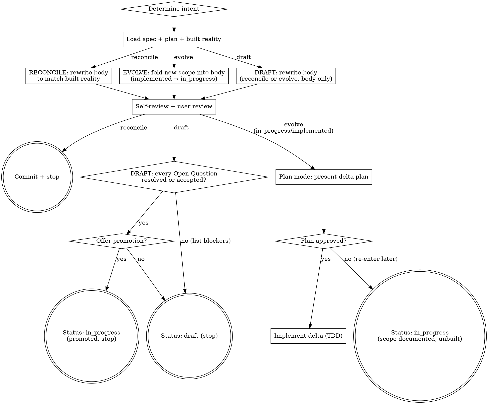

# Spec Update (Reconcile / Evolve an existing spec)

Keep an existing spec honest as reality drifts or scope grows — **without turning it into a changelog.** The spec describes one change to the system; this skill keeps that one description current.

<OPT-IN>
This skill is **opt-in**. Invoke it only when the user explicitly asks to update an existing `draft`, `in_progress`, or `implemented` spec — e.g., they name this skill, say "the spec drifted", "reconcile the spec to what we built", "add X to the spec", or "fix section 3 of the draft". It is the no-ceremony path: load the spec, apply the edit under the snapshot gate, commit, stop. Do NOT self-invoke for new features or open-ended creative work (route to `brainstorming`), for a full **build/review round** on a draft — approaches, top-down walk, approval ceremony (route to `spec-brainstorming`) — or for a **released/archived** spec (route to a new spec citing the archived ADR). The boundary is ceremony weight, not status: a targeted edit to a draft is this skill; a round is `spec-brainstorming`.
</OPT-IN>

<HARD-GATE>
The body is rewritten in place, at design altitude, never as a log of its own revisions. **Reconcile mode:** no code, no plan, status unchanged. **Evolve mode (in_progress/implemented):** do NOT invoke `writing-plans`; do NOT write code until the implementation plan (presented in plan mode) is approved — on approval, implement only the delta, never redoing already-built scope. **Evolve mode (draft):** body-only — do NOT enter plan mode and do NOT write code; a draft is an unapproved design and nothing is ever built from it in this skill. **Status:** reconcile leaves it unchanged; evolve flips `implemented → in_progress` (or leaves `in_progress`); a draft stays `draft` except at the terminal, where it may flip `draft → in_progress` ONLY on the user's yes to the promotion offer and ONLY when every Open Question is `- [x]`; this skill never sets `implemented` or `released`, and never invokes `writing-plans`. Do NOT edit a `released` spec (route to a new spec via `brainstorming`/`spec-brainstorming`); a full build/review round on a draft routes to `spec-brainstorming`.
</HARD-GATE>

## Core Principles

These principles override the rest of this skill when in conflict.

1. **Context before code.** Read the spec, its plan, and **what was actually built** (the diff, the code, recent commits) before touching the body. An update that ignores built reality invents drift. (For a **draft**: no plan exists and nothing was built from it — read the codebase it describes instead.)
2. **Specs carry design, not code.** Reference classes, methods, fields, configs, DTOs, contracts; no method bodies, algorithms, or actual code.
3. **The spec describes one change to the system, not a log of its own revisions.** The body states the target design of the change (what gets added, changed, or removed, and why) in the present tense. As the design evolves it is **rewritten in place** to keep that single description current and complete. The body must NOT become a changelog of the document — no "Deleted:", "Removed:", "Changed:", "Previously:", no before/after, no edit-dates. The spec describes that one change; the document's revision history lives in git commits and the archived ADR. *Open Questions is the only exception: it records decisions by design, not document revisions.*
4. **Calibrate to a human-reviewable altitude.** Per-task detail (what one task needs written, not the design itself) belongs in the plan, not the spec — and never in code. Keep the spec concrete enough that a plan agent can expand it into tasks.

## The Spec Lifecycle

A spec carries one of four statuses. `spec-brainstorming` creates drafts and approves them through its review round; this skill is the no-ceremony editor for any non-released spec — targeted edits on a `draft`, reconcile/evolve re-entry on `in_progress`/`implemented`; completion/release in `finishing-a-development-branch`.

```
draft ──(spec-brainstorming / brainstorming approves)──▶ in_progress
draft ──(spec-update: terminal promotion offer accepted)──▶ in_progress
in_progress ──(finishing: tests green)──▶ implemented
implemented ──(finishing: merge)──▶ released   [terminal → archive/]
implemented ──(spec-update: evolve)──▶ in_progress   [non-waterfall re-entry]
released ──▶ none (write a NEW spec citing the archived ADR)
```

| Status | Means | Written by |
|--------|-------|------------|
| `draft` | written, awaiting approval | `spec-brainstorming` (create, review, approve); `spec-update` (targeted edits, terminal promotion on request) |
| `in_progress` | approved; plan being written or executed | `spec-brainstorming` / `brainstorming` (approval); `spec-update` (draft promotion, evolve re-entry) |
| `implemented` | plan executed, tests green, not yet merged | `finishing-a-development-branch` |
| `released` | merged into base branch; archived as ADR | `finishing-a-development-branch` |

## Step 0 — Determine Intent

Resolve before anything else. The entry signal decides:

- **Reconcile** — scope is unchanged; the body just no longer matches what was built, or needs altitude/consistency fixes. ("the spec drifted", "make the spec match reality".) For a **draft**: nothing was built from it, so reconcile means consistency/altitude fixes, or re-aligning it with a codebase that drifted under it.
- **Evolve** — new or changed scope is being added to the same change. ("add X to the spec", "we also need Y".)
- **Target is a `draft`?** — accepted, with both intents draft-mapped (see [Draft Mode](#draft-mode)): the session is body-only. If the request wants a full round — propose 2–3 approaches, walk the draft top-down, approval ceremony — route to `spec-brainstorming` and say so.
- **Wrong status** — if `released`/archived, route to a new spec citing the ADR. Say so and stop.
- **Override** — the user can force an intent ("just reconcile, don't add scope"). Honor it.

If you can't tell, ask one question: *"Is the scope of this change staying the same (reconcile the description to reality), or are we adding/changing scope (evolve)?"*

## Checklist

Create a task for each and complete in order. Items 1, 5, 6, and 9 branch by intent.

1. **Determine intent** — reconcile vs evolve (Step 0). Refuse `released` targets.
2. **Read the provided context** — what the user says drifted, or what scope is being added.
3. **Load the spec, its plan, and built reality** — read the spec (single-file: the whole file; modular: `00-index.md` then the section file(s) this update touches — for reconcile that is every section, since reconcile compares the whole design against built reality; see [Modular Specs](#modular-specs)); read its plan under `docs/superpowers/plans/active/` (a **draft** has no plan — skip); inspect the diff/code/commits for what was actually built (for a **draft**: the current codebase it describes, since nothing was built from it). Note the `Status`.
4. **Explore project context** — files, docs, recent commits.
5. **Ask clarifying questions** — one at a time. In reconcile: frame as drift you found ("the spec says X, but the code does Y — which is current?"). In evolve: frame as gaps the new scope opens.
6. **Rewrite the body in place** — under the snapshot gate (Core Principle #3). In reconcile: correct the description so it states the change accurately as built; fix altitude and consistency; scope unchanged. In evolve: fold the new scope into the body as target design, alongside the existing scope (all stated as current design, never as history). Keep the spec at its existing path; do not rename or re-date. If the spec is modular (see [Modular Specs](#modular-specs)), edit the relevant section file(s) in place — not the whole spec — and a brand-new section becomes a new section file with a TOC update in `00-index.md`. Commit.
7. **Spec self-review** — including the snapshot check (below).
8. **User reviews the updated spec** — ask the user to review.
9. **Transition** — branches by intent (terminals below; for a `draft`, see [Draft Mode](#draft-mode) — terminal promotion offer).

## Reconcile Mode

Posture: **make the description match reality, scope unchanged.**

- Compare each section against what was built. Where they differ, decide which is current (ask if unclear) and rewrite the section to state the change accurately as built.
- Fix altitude drift and internal consistency the same way `spec-brainstorming` review does — but you are reconciling to *built* reality, not refining a design from scratch.
- **Nothing built yet?** If the spec is `in_progress` with no executed plan, there is nothing to reconcile against — tell the user, and limit the pass to altitude/consistency fixes only (or route to `spec-brainstorming` if the design itself needs rethinking).
- **Status: unchanged.** No plan. **Terminal:** after the user reviews, commit and stop. Do NOT invoke `writing-plans`.

## Evolve Mode

Posture: **grow the change's scope, then plan and implement it in-flow — no `writing-plans` document.**

- Clarifying questions one at a time on the new/changed scope; defer what can't be settled to Open Questions (append-only, never delete).
- Rewrite the body to include the new scope as target design, next to the existing scope — all present-tense current design, at design altitude (per-task detail goes to the plan), no "added later" / "now also" revision narration. If the spec is modular, a genuinely new section becomes a new `NN-<slug>.md` file (added to the index's TOC); changes to existing scope edit that section file in place. Commit.
- **Status:** evolve on `implemented` flips `implemented → in_progress` (re-opened); evolve on `in_progress` leaves it `in_progress`.
- **Plan the delta in plan mode** — enter plan mode and work out the implementation (files, interfaces, test design — design, not code) for only what isn't yet built:
  - **`implemented`** (was fully built): plan only the **delta** (the new/changed scope); the existing scope is already implemented.
  - **`in_progress`**: plan the new scope **plus any base scope not yet executed**; if nothing is built yet, plan the whole spec.
  Present the plan via `ExitPlanMode` for approval.
- **On approval, implement the delta** in this session, following TDD (use `subagent-driven-development` if subagents are available and the delta is non-trivial). Do NOT redo already-built scope. On completion, `finishing-a-development-branch` re-sets `implemented`.
- **If the plan is rejected:** the spec stays `in_progress` with the new scope documented but unbuilt; re-enter plan mode when ready. No code is written.

## Draft Mode

A **draft** update runs the same checklist with both intents draft-mapped. The session is **body-only**: rewrite the body, commit, stop — no plan mode, no code, no `writing-plans`. A draft is an unapproved design; nothing is ever built from it in this skill.

- **Reconcile-on-draft** — nothing was built from a draft, so reconcile compares the body against the **codebase it describes**, not a diff or plan: fix stale assumptions (related code shipped since the draft was written), altitude drift, and internal consistency. If nothing drifted, say so and limit the pass to altitude/consistency fixes.
- **Evolve-on-draft** — fold the new scope into the body as present-tense target design, next to the existing scope; **Status stays `draft`**. Questions the new scope opens go to Open Questions — read-write under the same rules as both `spec-brainstorming` rounds (append-only, never delete; resolve inline and reflect it in the body; may add new ones).
- If the draft lacks a `Status` line or an `## Open Questions` section (e.g. it came from the regular `brainstorming` skill), treat it as `Status: draft` with an empty Open Questions section and add both before proceeding.
- A full build/review round — approaches, top-down walk, approval ceremony — is `spec-brainstorming`'s, not this skill's.

**Terminal (item 9 for drafts).** After the user approves the updated spec, check the promotion gate — the Open Questions section exists and every item is `- [x]`:

- **Gate satisfied** → offer promotion: *"All Open Questions are resolved — promote this spec to `in_progress`?"* On **yes**: edit the `Status` line to `in_progress`, commit, stop, and tell the user `writing-plans` is next when they're ready — do NOT invoke it. On **no**: leave `Status: draft` and stop.
- **Gate unsatisfied** → list the remaining open questions as blockers and stop at `Status: draft`.

## Spec Self-Review

After rewriting the body, look at it with fresh eyes. Run the standard checks — status correctness, Open Questions integrity, template conformance, code leakage, placeholder scan, internal consistency, scope, ambiguity — **and** the snapshot checks:

1. **Revision-log scan:** search the body for revision-log tokens — e.g. `Deleted:`, `Removed:`, `Changed:`, `Updated:`, `Previously:`, `Old:`, `New:`, `Replaced`, `Migrated`, `was →`, `~~strikethrough~~`, and edit-dates or before/after framing. The list is exemplary, not exhaustive — the real test is *"is this narrating a revision to the document?"* Any hit is a failure: rewrite that span as a flat, present-tense statement of the target design of the change. The body describes the change; it is not a changelog of itself.
2. **Before/after framing:** any "originally X, now Y" or strikethrough narration → flatten to the current target design.
3. **Altitude:** per-task detail a human would skim rather than review belongs in the plan. Push it down; do not grow the spec.
4. **Reality match (reconcile):** does every reconciled section now match what was built? No invented behavior.
5. **Modular integrity (if the spec is modular):** `00-index.md` is the only file carrying a `Status:` line or an `## Open Questions` heading; every section file appears in the TOC and every TOC entry has a file; a new section was added as a file with a matching TOC row.

*(Open Questions' checked items carry resolution + date by design — those are decision records, not document revisions; the scan above does not flag them. No other section is exempt — do not invent a "Notes"/"History"/"Change Log" section to park revision narration.)*

Fix issues inline. No need to re-review — just fix and move on.

## Status Transitions This Skill Writes

- Reconcile: **none** (status unchanged).
- Evolve on `implemented`: `implemented → in_progress`.
- Evolve on `in_progress`: stays `in_progress`.
- Draft (either intent): stays `draft` — except the terminal promotion offer: on the user's yes, and only when the Open Questions section exists and every item is `- [x]`, `draft → in_progress`. Never followed by a `writing-plans` invocation in this session.
- This skill **never** sets `implemented` or `released` — those are `finishing-a-development-branch`'s.

## User Review Gate

After the self-review passes:

> "Spec updated and committed to `<path>` (Status: <status>, <reconcile|evolve>). Please review it before we move on."

Wait for the response. If they request changes, make them and re-run the self-review. Only proceed to the terminal once they approve. For a `draft`, once they approve, make the terminal promotion offer (see [Draft Mode](#draft-mode)) instead of proceeding to an intent terminal.

## Process Flow



**Terminal state.** Reconcile ends at a committed spec, status unchanged, no plan, no code. Evolve ends one of two ways: the delta plan is **approved** → implement it in-session (TDD; `finishing` later re-sets `implemented`); or **rejected** → the spec stays `in_progress` with the new scope documented but unbuilt. A **draft** ends body-only at `Status: draft` — or, when every Open Question is resolved or accepted and the user says yes to the terminal promotion offer, at `Status: in_progress`, with no `writing-plans` invocation. `writing-plans` is never invoked — planning happens in plan mode. Code is written only after plan approval, and only for the delta.

## Custom Spec Template

Same fit-check protocol as `spec-brainstorming`: if `docs/superpowers/spec-template.md` exists, map the updated design onto it and surface every mismatch in one batched message before deviating. A `Status` line and an `## Open Questions` section are expected; add them if missing. If the spec is modular (`00-index.md` + section files), follow the [Modular Specs](#modular-specs) access protocol regardless of the template.

## Modular Specs

A spec may be modular — see the `brainstorming` skill's Modular Specs for the layout and access protocol. Read `00-index.md` then the section file(s) this update touches (every section for reconcile, only the touched ones for evolve); edit in place. A genuinely new section becomes a new `NN-<slug>.md` file with a TOC row in the index; Status is unchanged in reconcile. Convert on request.
